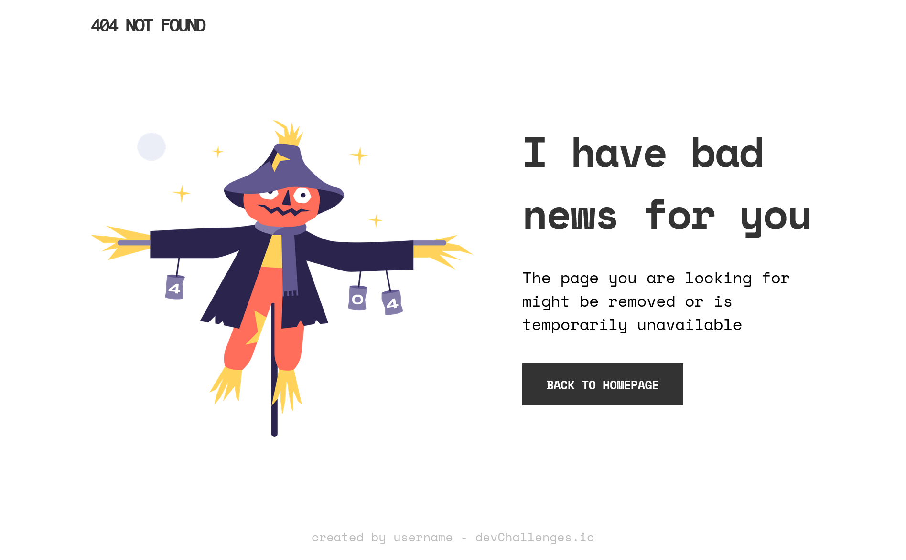
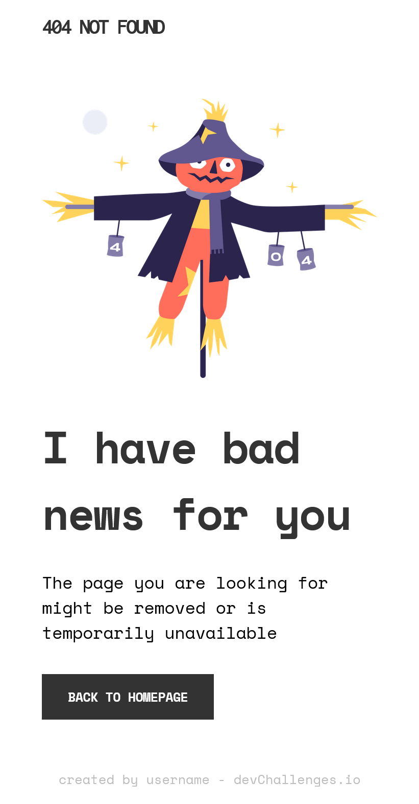

<h1 align="center">404 Not Found</h1>

   Solution for a challenge from  <a href="http://devchallenges.io" target="_blank">Devchallenges.io</a>.

  <h3>
    <a href="https://mibenin.github.io/devchallenges.io-responsive-web-developer/404-not-found-master/index.html">
      Demo
    </a>
     | 
    <a href="https://github.com/MIBENIN/devchallenges.io-responsive-web-developer/tree/main/404-not-found-master">
      Solution
    </a>
     | 
    <a href="https://devchallenges.io/challenges/wBunSb7FPrIepJZAg0sY">
      Challenge
    </a>
  </h3>

## Table of Contents

- [Overview](#overview)
  - [Built With](#built-with)
- [Contact](#contact)

## Overview

### Built With

HTML
CSS
SEMANTIC MARKUP
CSS FLEXBOX
GOOGLE FONTS

## Features

This application/site was created as a submission to a [DevChallenges](https://devchallenges.io/challenges) challenge. The [challenge](https://devchallenges.io/challenges/wBunSb7FPrIepJZAg0sY) was to build an application to complete the given user stories.

## Contact

- GitHub [@MIBENIN ](https://github.com/MIBENIN})
